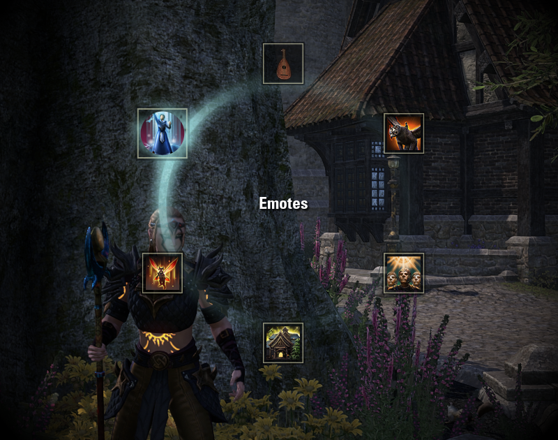

# ESOPie
ESOPie is a radial action-binding addon inspired by the WoW addon [OPie by cfxfox](https://www.townlong-yak.com/addons/opie).

ESOPie provides up to 6 bindings to display rings of usable slots much like the Quickslot feature with two main differences;
* ESOPie activates the slotted action immediately. You do not have to press another key to activate it.
* ESOPie slots can activate sub-rings, providing a deep tree of options.

Currently supported actions:

* Open a sub-ring
* Execute a slash command
* Play an emote

Actions that are currently not supported but I would like to add:

* Summon a companion or assistant
* Set the active mount
* Set the active non-combat pet
* Play a momento
* Send a chat message
* Execute a Lua snippet
* Use slottable items
* Integrate with other addons (ex. change Dressing Room presets)

## 📦 Installation
Download the latest stable [release](https://github.com/jrdmellow/ESOPie/releases).

Extract the contents of the archive and copy or move the `ESOPie` folder into your `Documents/Elder Scrolls Online/live/AddOns` folder.

Boot the game or reload the UI if already logged in. ESOPie should appear in the Add-Ons menu.

## 🏁 Usage
#### 🚨 Do this first!
Before doing anything else you must bind a key or button to trigger ESOPie. Go to your control settings and bind at least one of the 6 available slots.

#### ℹ Using ESOPie
ESOPie comes with some preset rings and slots. Try them out to get a feel for the controls.

ESOPie behaves similarly to the Quickslot radial menu; ESOPie will display the associated ring when a bound key or button is held down. While opened, moving the mouse will select a slot. Releasing the binding will close ESOPie and activate the selected slot.

*Note: Activating a `subring` slot will do nothing. To use subring slots, click them with Left Mouse while keeping the binding pressed. The displayed ring will close and the subring will take its place.*

## ⚙ Configuration
#### 💍 Create some Rings
ESOPie is all about rings of slots. Rings can be either be nested or be directly bound to a key.

Open up the ESOPie settings in the Add-Ons submenu.

Under the general settings you will see a secion to Configure Rings and Slots. Here you can click `New Ring` to add an empty ring. The new ring will be selected automatically and from here you can add some slots.

#### 🎰 Slots slots slots
Slots are the core of ESOPie. All actions are bound to a slot. To create a new slot, select a ring from the `Entry to Configure` dropdown and open the `Configure Selected Ring` submenu.

Click `New Slot`.

Select the newly created slot from the `Entry to Configure` dropdown.

Set a name for the new slot.

The `Configure Selected Slot` submenu should now be lit up. Open it up and change the icon if desired.

Select an action for the slot to perform when activated. One of the submenus below should be lit up. Open it and configure to your liking.

#### 🎬 Slot Actions
Several slot actions are supported. Most actions should be self-explanatory, however there is one special action that may be confusing at first; `Open Subring` actions will do nothing when activated, instead they must be clicked with Left Mouse while the bound key or button remains held. The displayed ring will close and the subring will take its place. Releasing the binding will activate a selected action within the subring as normal.

##  Contributors
Special thanks to some people that have provided feedback during the development of this addon.

* PenguinAirborne
* bubbarush
